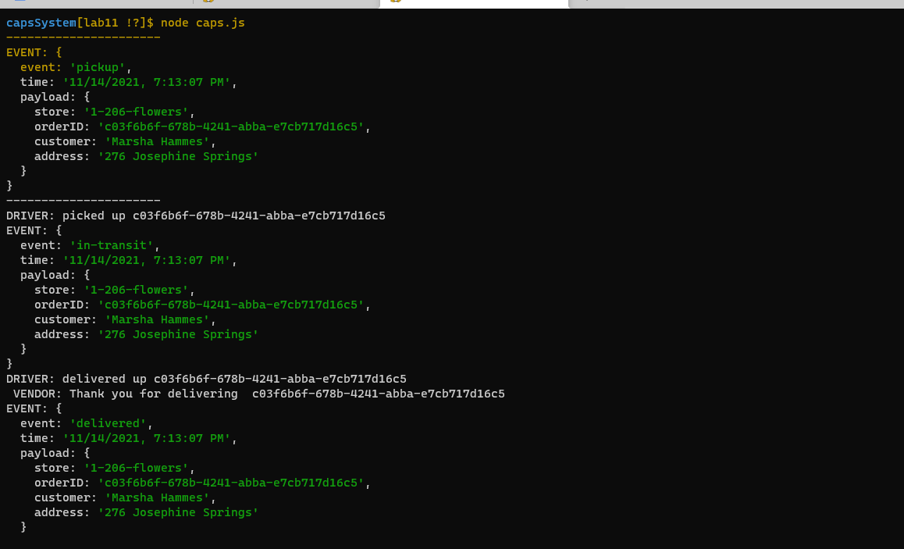
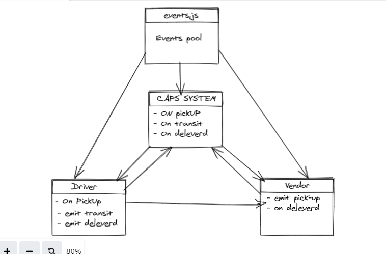

# capsSystem

## LAB - 11
- [Readme File ](https://github.com/MohammadAljadayh/capsSystem/blob/main/README.md).
- [Action](https://github.com/MohammadAljadayh/capsSystem/actions).
- [pull request](https://github.com/Abu-laban/caps/pull/1).
- [Main Repo](https://github.com/MohammadAljadayh/capsSystem).

> Setup

`.env` **requirements**

- `STORE` = 1-206-flowers

> Running the app

- `node caps.js`

> Tests

- Unit Tests: `npm run test`

> UML

