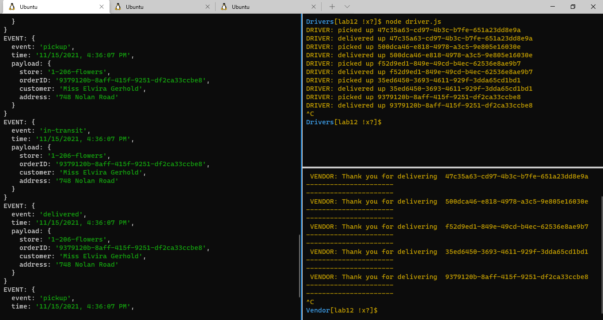
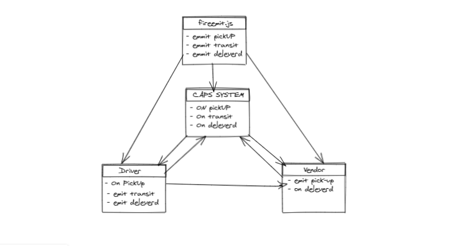

# capsSystem

## LAB - 12
- [Readme File ](https://github.com/MohammadAljadayh/capsSystem/blob/main/README.md).
- [Action](https://github.com/MohammadAljadayh/capsSystem/actions).
- [pull request](https://github.com/MohammadAljadayh/capsSystem/pull/3).
- [pull request](https://github.com/MohammadAljadayh/capsSystem/pull/4).
- [ Socket branch Repo](https://github.com/MohammadAljadayh/capsSystem/tree/lab12).

> Setup

`.env` **requirements**
- `PORT` = `3000`
- `host` = `http://localhost:3000`

- `STORE` = 1-206-flowers

> Running the app

- `node caps.js`
- `node vendor.js`
- `node driver.js`

> Tests

- Unit Tests: `npm run test`

> UML

